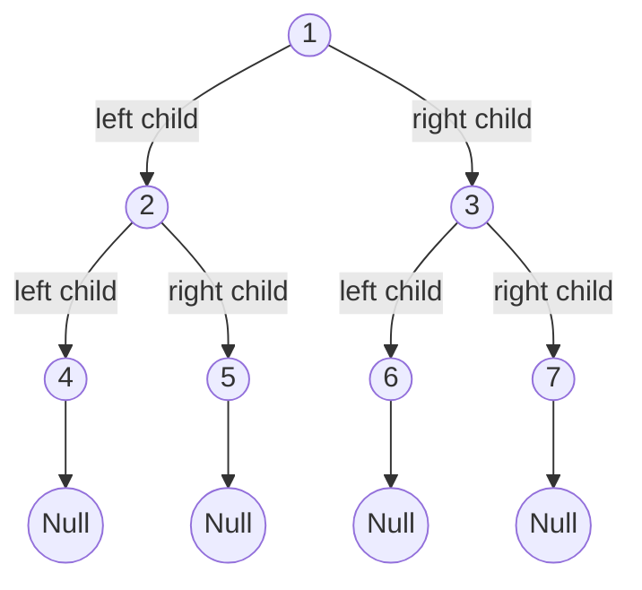

# Singleton Design Pattern
---

## Motivation

Sometimes it's important to have only one instance for a class. For example, in a system there should be only one window manager (or only a file system or only a print spooler). Usually singletons are used for centralized management of internal or external resources and they provide a global point of access to themselves.

The singleton pattern is one of the simplest design patterns: it involves only one class which is responsible to instantiate itself, to make sure it creates not more than one instance; in the same time it provides a global point of access to that instance. In this case the same instance can be used from everywhere, being impossible to invoke directly the constructor each time.

---

## Intent
- Ensure that only one instance of a class is created.
- Provide a global point of access to the object.

---


---

```java
class Singleton {
	private static Singleton instance;

	private Singleton() {
		...
	}
	
	public static synchronized Singleton getInstance(){

		if (instance == null)
			instance = new Singleton();

		return instance;
	}
	
	public void doSomething()
	{
		...
	}
}
```

---

## Important Points
- **Multithreading** - A special care should be taken when singleton has to be used in a multithreading application.
- **Serialization** - When Singletons are implementing Serializable interface they have to implement readResolve method in order to avoid having 2 different objects.
- **Classloaders** - If the Singleton class is loaded by 2 different class loaders we'll have 2 different classes, one for each class loader.
- **Global Access Point represented by the class name** - The singleton instance is obtained using the class name. At the first view this is an easy way to access it, but it is not very flexible. If we need to replace the Sigleton class, all the references in the code should be changed accordinglly.

---


